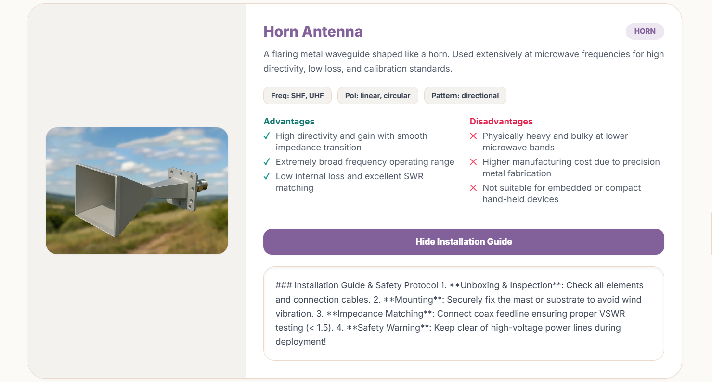
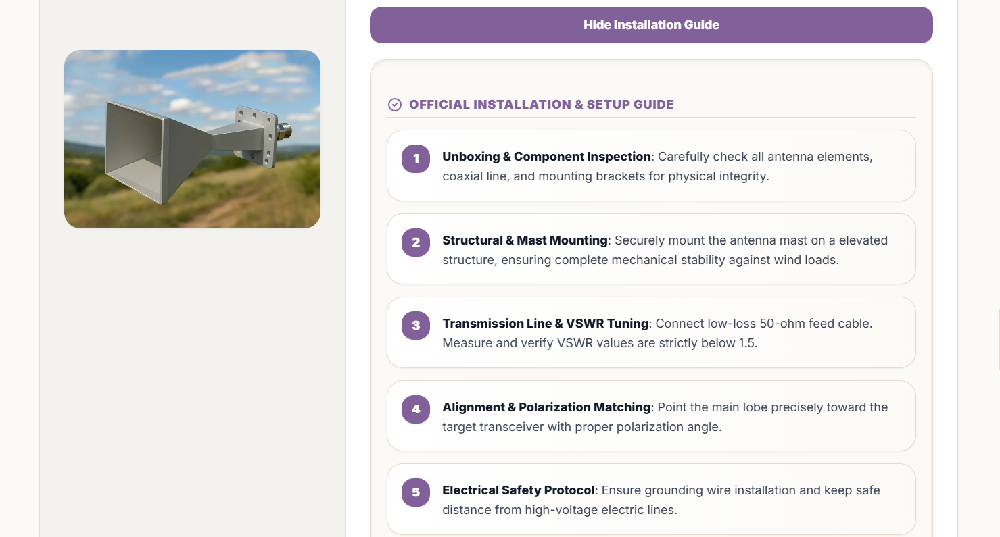
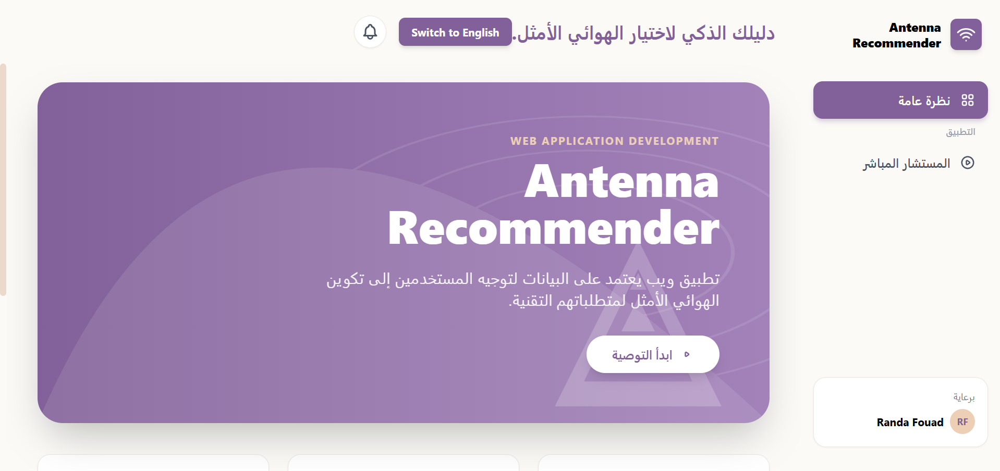
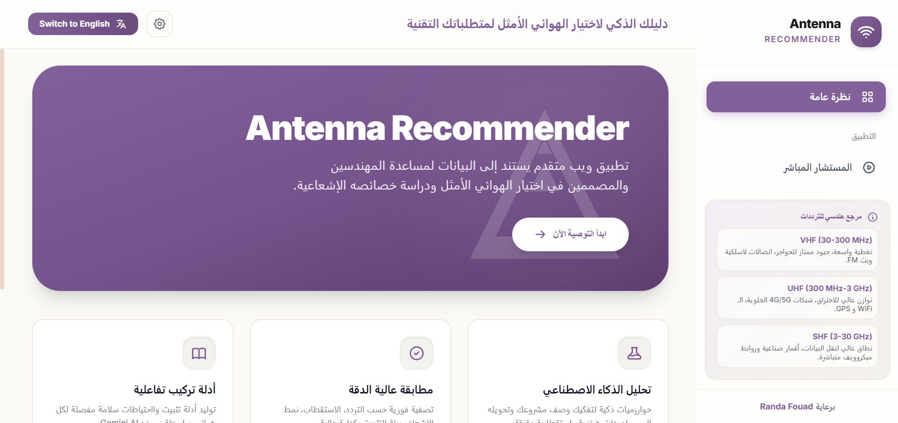
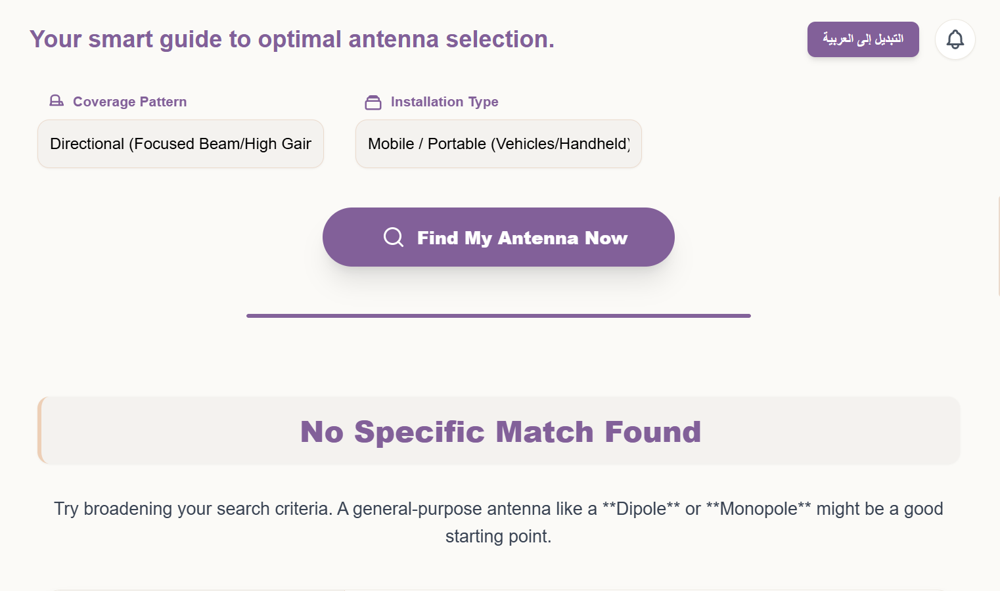
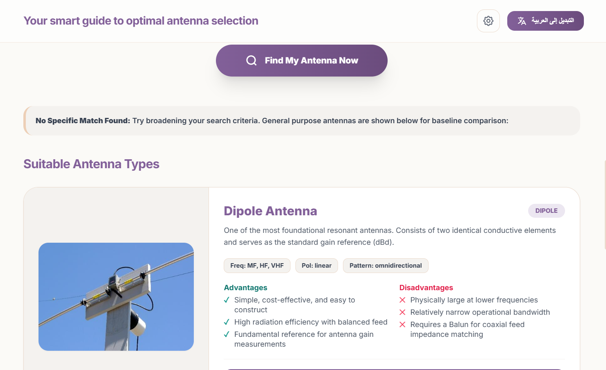

# Debugging & Investigation Board

## Project Information
* **Project Name:** Antenna Recommender System
* **Report Date:** July 23, 2026
* **Status:** Resolved / Verified

---

## 1. Investigation Statement

We investigated 5 major UI and functional issues in the Antenna Recommender application to improve user experience, dynamic content formatting, and language switching (Arabic/English):

* **Issue 1 (Dropdown Sync):** Changing the frequency back to "Any Frequency" kept invalid options active in the application dropdown.
* **Issue 2 (API Latency & Freezes):** Missing Gemini API key or slow internet caused an infinite loading spinner when running project analysis.
* **Issue 3 (Raw AI Text):** AI-generated installation guide appeared as unformatted text with raw markdown tags (`**`, `#`).
* **Issue 4 (Zero Match Blank Screen):** Selecting conflicting filters resulted in a completely empty page without helpful feedback.
* **Issue 5 (RTL/LTR Layout Shift):** Switching languages updated text but failed to adjust page alignment, sidebars, and UI cards correctly.

---

## 2. Reproduction Records

### Case A: Unformatted AI Markdown (Issue 3)
1. Click on **"Get AI Installation Guide"**.
2. Observe the returned text on the screen.
3. **Observed Result:** Text shows raw `#` and `**` symbols instead of formatted visual cards.

### Case B: Zero Search Match Blank Screen (Issue 4)
1. Set **Frequency** filter to `HF`.
2. Set **Installation** filter to `Embedded`.
3. Click **"Find My Antenna Now"**.
4. **Observed Result:** Page is completely blank.

---

## 3. Narrowed Technical Target

* **UI & Formatting:** Focus on `parseMarkdownToHtml()` for rendering AI guides and CSS/HTML card sizes for better page flow.
* **State & Alignment:** Target `setLanguage()` to update root DOM attributes (`dir="rtl"` / `dir="ltr"`) and fix dropdown cleanup logic in `updateApplicationDropdown()`.
* **API Fallbacks:** Address uncaught HTTP errors in `callGemini()` by adding a local fallback mode.
* **Excluded:** No core backend server changes needed; all fixes are focused on front-end stability and API error handling.

---

## 4. Split Diagnosis (Defect vs Ambiguity)

* **Code Defects:** 
  * Missing DOM direction attributes during translation toggles.
  * Absence of a text parser before assigning raw AI responses to `innerHTML`.
  * Missing fallback UI when filter results return an empty array `[]`.
* **Handled Edge Cases:** 
  * Missing API keys or network disconnects causing infinite loading loops.

---

## 5. Bounded Fix Plan

* **Fix 1:** Add custom parser function `parseMarkdownToHtml()` to render AI guide responses into clean step-by-step UI cards.
* **Fix 2:** Update `setLanguage()` to set `dir="rtl"` or `dir="ltr"` on root HTML elements alongside dynamic image and card size updates.
* **Fix 3:** Update `handleFindAntennaClick()` to display a "No exact match found" card with general fallback recommendations.
* **Fix 4:** Add local heuristic mode in `callGemini()` to safely return antenna suggestions within 1.2s when API keys are missing.

---

## 6. Proof & Verification Record

| Test Case ID | Scenario | Expected Outcome | Status |
| :--- | :--- | :--- | :--- |
| **TC-QA-01** | Switch between Arabic & English repeatedly | Text and page direction (`dir`) flip seamlessly without layout breaks | **PASS** |
| **TC-QA-03** | Resize browser window below 768px | Mobile view and card grids resize properly | **PASS** |
| **TC-QA-04** | Click "Get AI Installation Guide" | AI guide displays as clean, formatted step cards | **PASS** |
| **TC-QA-05** | Submit conflicting filter search | Clear warning message and fallback antennas appear | **PASS** |

### Visual Proof (Before & After)

#### 1. Issue 3: AI Installation Guide Formatting
| Before Fix (Raw Markdown) | After Fix (Formatted Step Cards) |
| :---: | :---: |
|  |  |

#### 2. Issue 5: Language Alignment (RTL/LTR)
| Before Fix (Shifted Layout) | After Fix (Aligned RTL Layout) |
| :---: | :---: |
|  |  |

#### 3. Issue 4: Zero Match Search Feedback
| Before Fix (Blank Screen) | After Fix (Fallback Notice Card) |
| :---: | :---: |
|  |  |
