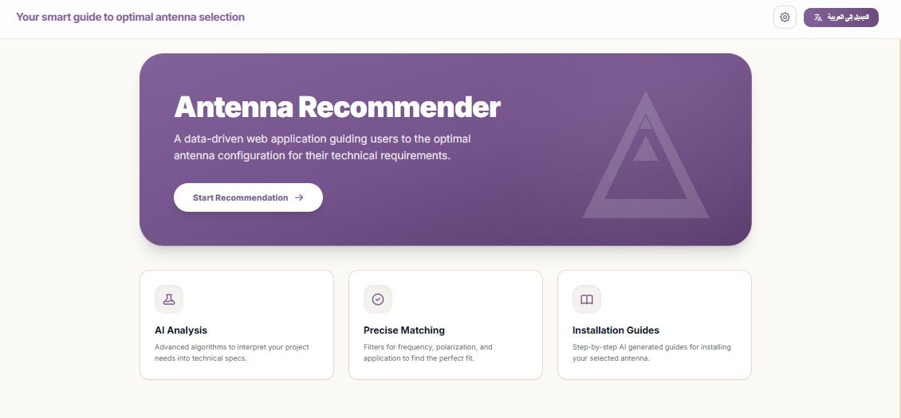
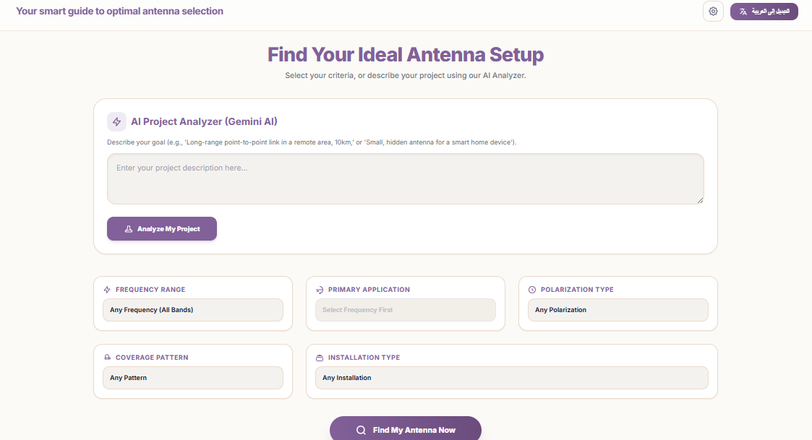
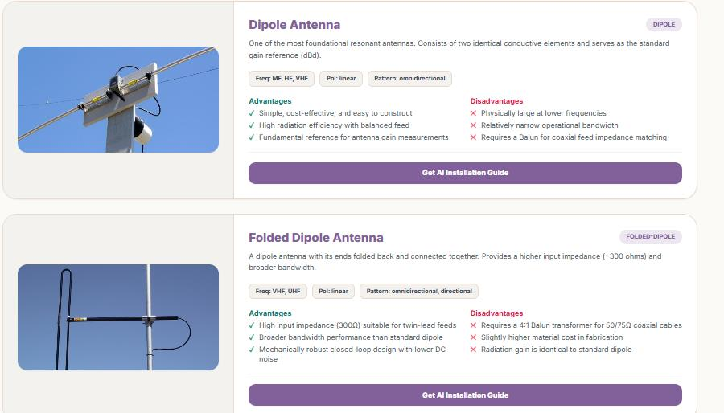

# Antenna Recommender

**Your smart guide to optimal antenna selection.**

A responsive, AI-assisted web application that helps students, RF engineers, and researchers choose the right antenna for their technical requirements — no login, no specialist expertise required.



---

## The Problem

Antenna selection depends on several interacting technical parameters (frequency, gain, application, beamwidth, and more). Existing reference material is scattered across textbooks, datasheets, and vendor sites, and interpreting it correctly requires a level of RF expertise many students and early-career engineers don't yet have.

## The Solution

Antenna Recommender takes a user's technical inputs and runs them through a recommendation engine — decision-tree / lookup-table logic validated by Subject Matter Experts — and returns a primary recommendation, at least one alternative, and a full side-by-side comparison. The whole flow takes three steps and works in both English and Arabic.

## Features

- **Technical Parameter Input** — frequency, application type, required gain, polarization, coverage pattern, and installation type, with input validation.
- **AI Project Analyzer** — describe your project in plain language and Gemini AI extracts the technical filters for you.
- **Intelligent Recommendation Engine** — multi-parameter filtering with a dynamic fallback to general-purpose antennas (e.g. Dipole/Monopole) when there's no direct match.
- **Antenna Comparison** — side-by-side table covering gain, beamwidth, polarization, size, and cost.
- **Characteristics & Radiation Patterns** — interactive polar plots and physical characteristics for every recommendation.
- **AI Installation Guide Generator** — step-by-step, safety-noted installation instructions, auto-translated to Arabic.
- **Bilingual / RTL Support** — instant English ⇄ Arabic switching with automatic layout direction.
- **Fully Responsive** — works across Chrome, Firefox, and Edge on desktop, tablet, and mobile.

| Input & Recommendation | Antenna Results & Comparison |
|---|---|
|  |  |

## Tech Stack

- **Frontend:** HTML, JavaScript, Tailwind CSS
- **AI Integration:** Google Gemini API (structured project analysis + installation guide generation)
- **Data Layer:** Single source-of-truth `antennaData` array (Dipole, Monopole, Yagi-Uda, Parabolic Dish, Patch Microstrip, Loop, Helical) with mapped RF parameters
- **i18n:** Custom bilingual switcher (English / Arabic, LTR / RTL)

## Getting Started

### Prerequisites

- A modern browser (Chrome, Firefox, or Edge)
- A [Gemini API key](https://ai.google.dev/) for the AI Analyzer and Installation Guide features

### Installation

```bash
git clone https://github.com/<your-org>/antenna-recommender.git
cd antenna-recommender
```

Create a `.env` file (or your environment's equivalent) and add your Gemini API key:

```
GEMINI_API_KEY=your_api_key_here
```

> ⚠️ Never commit your API key. `.env` is included in `.gitignore`.

Then open `index.html` in your browser, or serve the folder locally:

```bash
npx serve .
```

## Project Structure

```
antenna-recommender/
├── index.html
├── /src
│   ├── data/           # antennaData source of truth
│   ├── engine/          # filterAntennas() recommendation logic
│   ├── ai/              # Gemini integration (analyzer + installation guide)
│   ├── i18n/            # language + RTL/LTR handling
│   └── ui/               # components, result cards, comparison table
├── /docs
│   ├── Project_Brief.pdf
│   ├── BRD.pdf
│   ├── PRD.pdf
│   └── Action_Plan.docx
└── README.md
```

*(Adjust paths above to match your actual repo layout.)*

## Requirements at a Glance

| Metric | Target |
|---|---|
| Recommendation accuracy | ≥ 95% (validated against SME benchmarking) |
| Response time | < 3 seconds under normal load |
| Task completion rate | ≥ 90% in usability testing |
| Steps to result | ≤ 3 |
| Browser support | Chrome, Firefox, Edge — fully responsive |

## Roadmap / Status

Built around five delivery epics: system architecture & data modeling, core recommendation logic, responsive multilingual UI, Gemini AI integration, and QA/optimization. See `/docs/Action_Plan.docx` for the full task breakdown and acceptance criteria.

**Out of scope (v1):** physical antenna testing/fabrication, real-time external database integration, user accounts & login.

## Documentation

- [Project Brief](docs/Project_Brief.pdf)
- [Business Requirements Document](docs/BRD.pdf)
- [Product Requirements Document](docs/PRD.pdf)
- [Action Plan](docs/Action_Plan.docx)

## Team

- Doaa Alaaelden
- Nourin Elshenawi — Project Manager
- Rowan Mohamed
- Marina Essam

**Sponsor:** Dr. Randa Fouad

## License

Add your license here (e.g. MIT).
